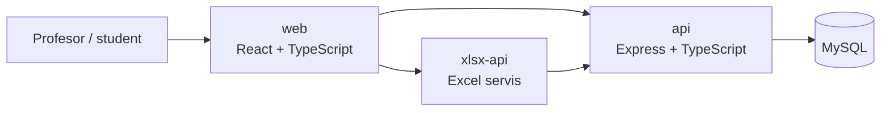

# AD-Spisak

SaaS aplikacija za **evidenciju i evaluaciju uspeha studenata**, razvijena u okviru master rada *„Metodologije i prakse u razvoju SaaS rešenja za evidenciju i evaluaciju uspeha studenata“*.

Repozitorijum je organizovan kao monorepo kako bi kompletno rešenje bilo pregledno na jednom mestu i jednostavno za pokretanje tokom demonstracije.

## Pregled sistema



### Delovi repozitorijuma

| Folder | Uloga | Tehnologije |
|---|---|---|
| [`web/`](web/) | Klijentska aplikacija | React, Vite, TypeScript, Tailwind CSS |
| [`api/`](api/) | Glavni REST API i poslovna logika | Express, TypeScript, MySQL, JWT |
| [`xlsx-api/`](xlsx-api/) | Izdvojeni servis za Excel izvoz | Express, TypeScript, ExcelJS |
| [`docs/`](docs/) | Arhitektura, rezultati merenja i plan demonstracije | Markdown |

> **Napomena o arhitekturi:** javni monorepo je konsolidovan radi jednostavnijeg pregleda i demonstracije. U okviru `api/` domeni su odvojeni kroz kontrolere, servise, repozitorijume i modele, dok je Excel obrada izdvojena u poseban servis. Ovakva organizacija zadržava jasne granice odgovornosti bez nepotrebnog dupliranja zajedničkog koda u repozitorijumu.

## Funkcionalne celine

Aplikacija pokriva ključne tokove nastavnog procesa:

- autentifikaciju korisnika i kontrolu pristupa;
- upravljanje korisnicima i studentima;
- upravljanje predmetima;
- evidenciju prisustva;
- evidenciju poena i predispitnih obaveza;
- projektne zadatke;
- termine odbrane;
- pregled rezultata studenta;
- uvoz/izvoz podataka kroz Excel.

## Organizacija API sloja

Glavni API je podeljen po domenima. Svaka oblast ima zaseban ulazni sloj i poslovnu logiku, npr. autentifikacija, korisnici, predmeti, projekti, odbrane, prisustvo i poeni. Ulazna tačka aplikacije povezuje te domene u REST API, dok pristup bazi ostaje izdvojen od HTTP sloja.

Detaljniji prikaz je u [`docs/ARCHITECTURE.md`](docs/ARCHITECTURE.md).

## Pokretanje

### 1. Kloniranje

```bash
git clone https://github.com/owlCoder/AD-Spisak.git
cd AD-Spisak
```

### 2. Konfiguracija okruženja

Kopirati `.env.example` u `.env` unutar svakog paketa i popuniti vrednosti.

**`api/.env`**

```env
DB_HOST=
DB_PORT=
DB_USER=
DB_PASSWORD=
DB_NAME=
DB_SSL_MODE=
JWT_SECRET=
```

**`web/.env`**

```env
VITE_NAZIV_VERZIJA=
VITE_API_URL=
VITE_API_URL_EXCEL=
```

**`xlsx-api/.env`**

```env
API_URL=
JWT_SECRET=
```

Tajne i realni pristupni podaci nisu deo repozitorijuma.

### 3. Instalacija zavisnosti

Iz korena repozitorijuma:

```bash
npm run install:all
```

ili pojedinačno:

```bash
npm install --prefix api
npm install --prefix xlsx-api
npm install --prefix web
```

### 4. Razvojno pokretanje

U tri terminala:

```bash
npm run dev:api
npm run dev:xlsx
npm run dev:web
```

### 5. Provera build-a

```bash
npm run build
```

## Rezultati evaluacije

Tokom evaluacije opisane u master radu zabeleženi su sledeći rezultati:

- **318 testova** u sedam test skupova;
- **100% uspešnih testova**, bez neuspešnih slučajeva;
- izdvojeni test slučajevi: **36–80 ms**;
- prosečna vremena odziva posmatranih domena: **43–76 ms**;
- propusnost pod opterećenjem stabilizovana na približno **590–610 zahteva/s**;
- u poređenju arhitektura, izmerena upotreba resursa za modularizovano rešenje bila je **12–55%**, naspram približno **70%** u početnom monolitnom scenariju.

Metodologija i kontekst ovih merenja dokumentovani su u [`docs/MEASUREMENTS.md`](docs/MEASUREMENTS.md).

## Materijal za odbranu

Za brzu demonstraciju i pregled ključnih tačaka koristiti [`docs/ODBRANA.md`](docs/ODBRANA.md).

Dokument sadrži:

- redosled demonstracije;
- koje delove koda pokazati komisiji;
- kratke odgovore na očekivana pitanja;
- rezervni plan ako cloud servis nije dostupan tokom odbrane.

## Deployment

Frontend i serverski paketi sadrže Vercel konfiguraciju. Deployment može da se vodi odvojeno po paketu, uz promenljive okruženja definisane na platformi.

## Autor

**Danijel Jovanović** — [`@owlCoder`](https://github.com/owlCoder)

Ovaj repozitorijum predstavlja autorsku implementaciju razvijenu za potrebe master rada.
