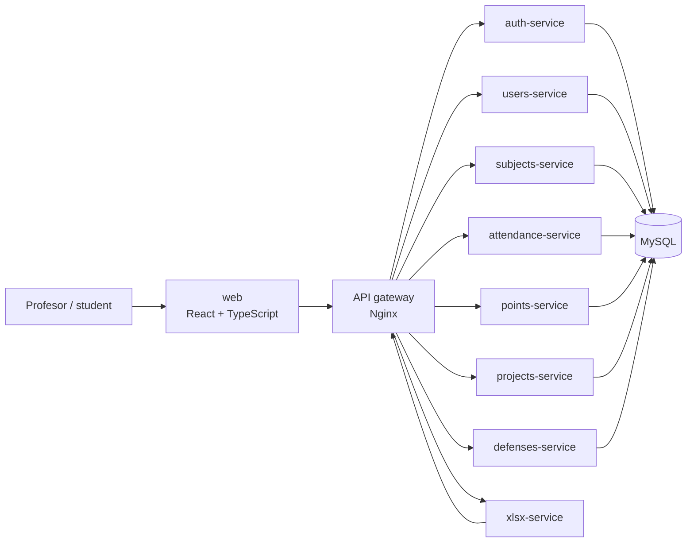

# AD-Spisak — microservices Docker verzija

SaaS aplikacija za **evidenciju i evaluaciju uspeha studenata**, razvijena u okviru master rada *„Metodologije i prakse u razvoju SaaS rešenja za evidenciju i evaluaciju uspeha studenata“*.

Ova grana je pripremljena za odbranu rada: funkcionalne celine glavnog API-ja pokreću se kao **zasebni procesi/kontejneri**, ispred njih se nalazi API gateway, a kompletno lokalno okruženje se podiže jednom Docker Compose komandom.

## Arhitektura



Glavni domeni koriste isti TypeScript codebase, ali svaki kontejner dobija sopstveni `SERVICE_NAME` i registruje **isključivo svoje rute**. Time su servisi fizički odvojene runtime jedinice, mogu da se pokreću, zaustavljaju i skaliraju nezavisno. Excel izvoz je poseban servis sa sopstvenim paketom.

> Za lokalnu odbrambenu verziju servisi dele jednu MySQL instancu kako bi demo bio determinističan i jednostavan za resetovanje. To ne menja činjenicu da su aplikativni servisi zasebni procesi; database-per-service je mogući naredni korak, ali nije uslov za mikroservisni deployment.

Detalji: [`docs/ARCHITECTURE.md`](docs/ARCHITECTURE.md) i [`docs/DOCKER-MICROSERVICES.md`](docs/DOCKER-MICROSERVICES.md).

## Brzi start za odbranu

Potrebni su samo **Docker Desktop** i Docker Compose.

```bash
git checkout odbrana-microservices-docker
docker compose up --build
```

Kada su servisi `healthy`, otvoriti:

- aplikacija: http://localhost:5173
- API gateway: http://localhost:8080/api/health

### Demo nalog nastavnika

- predmet: `Demo predmet - AD Spisak`
- email: `nastavnik@demo.local`
- lozinka: `Odbrana2026!`

Studenti koriste `student1@demo.local`, `student2@demo.local` i `student3@demo.local` sa istom demo lozinkom.

Demo kredencijali su namerno javni i važe **isključivo za lokalnu Docker bazu**.

## Servisi i portovi

| Servis | Uloga | Host port |
|---|---|---:|
| `web` | React klijent | 5173 |
| `gateway` | jedinstvena ulazna tačka | 8080 |
| `auth-service` | prijava i JWT | 3101 |
| `users-service` | korisnici + Excel import | 3102 |
| `subjects-service` | predmeti | 3103 |
| `attendance-service` | prisustvo | 3104 |
| `points-service` | poeni + agregirani export podaci | 3105 |
| `projects-service` | projektni zadaci | 3106 |
| `defenses-service` | termini odbrane | 3107 |
| `xlsx-service` | generisanje Excel datoteka | 3108 |
| `mysql` | lokalna demo baza | 3307 |

Direktna provera jednog servisa, na primer:

```bash
curl http://localhost:3105/api/health
```

## Korisne Docker komande

```bash
npm run docker:up       # build + start
npm run docker:ps       # pregled kontejnera
npm run docker:logs     # objedinjeni logovi
npm run docker:down     # zaustavljanje
npm run docker:reset    # briše i bazu; sledeći start ponovo seed-uje demo podatke
```

Za tihu pripremu pred odbranu:

```bash
docker compose up -d --build
docker compose ps
```

## Bez Dockera

Originalni način pokretanja paketa ostaje dostupan:

```bash
npm run install:all
npm run dev:api
npm run dev:xlsx
npm run dev:web
```

Ako se glavni API pokrene bez `SERVICE_NAME`, ponaša se kao ranije i registruje sve rute (`SERVICE_NAME=all`).

## Rezultati evaluacije

U master radu su dokumentovani sledeći rezultati:

- **318 testova**, 0 neuspešnih;
- izdvojeni test slučajevi **36–80 ms**;
- prosečna vremena odziva **43–76 ms**;
- stabilizacija propusnosti na približno **590–610 zahteva/s**;
- izmerena upotreba resursa **12–55%** u odnosu na približno **70%** u početnom monolitnom scenariju.

Kontekst merenja: [`docs/MEASUREMENTS.md`](docs/MEASUREMENTS.md).

## Materijal za odbranu

Praktičan redosled demonstracije i odgovori na očekivana pitanja nalaze se u [`docs/ODBRANA.md`](docs/ODBRANA.md).

## Autor

**Danijel Jovanović** — [`@owlCoder`](https://github.com/owlCoder)
