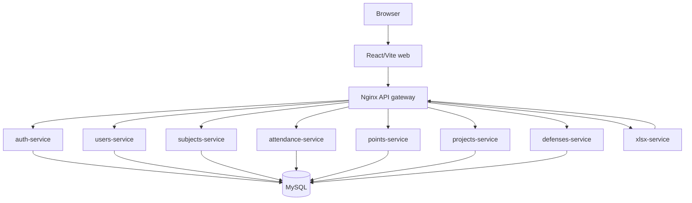

# Arhitektura — microservices Docker verzija

## Cilj ove grane

Grana `odbrana-microservices-docker` fizički razdvaja funkcionalne domene glavnog API-ja u zasebne runtime jedinice. Isti TypeScript izvorni kod se koristi kao zajednička osnova, ali svaki kontejner dobija `SERVICE_NAME` i registruje samo rute koje pripadaju njegovom domenu.

To omogućava da se servisi nezavisno pokreću, gase, restartuju i skaliraju, bez dupliranja gotovo identične infrastrukture i pomoćnog koda u repozitorijumu.

## Runtime dijagram



## Granice servisa

| Servis | Rute/domen |
|---|---|
| `auth-service` | `/api/auth/*` |
| `users-service` | `/api/korisnik/*`, `/api/studenti`, `/api/xlsx/convert` |
| `subjects-service` | `/api/predmet/*`, `/api/predmeti` |
| `attendance-service` | `/api/evidencija/*` |
| `points-service` | `/api/poeni/*`, `/api/export` |
| `projects-service` | `/api/projektni-zadatak/*`, `/api/projektni-zadaci` |
| `defenses-service` | `/api/termin/*`, `/api/termini` |
| `xlsx-service` | `/api/xlsx/export`, `/api/xlsx/projects/export` |

Gateway je jedina adresa koju klijent mora da poznaje. Frontend zato koristi `http://localhost:8080/api`, dok gateway na osnovu URL-a prosleđuje zahtev odgovarajućem servisu.

## Kako je od jednog API-ja dobijeno više mikroservisa

Ulazna tačka `api/api/index.ts` više ne mora da registruje sve kontrolere. Vrednost `SERVICE_NAME` određuje koji domen se aktivira:

- `auth`
- `users`
- `subjects`
- `attendance`
- `points`
- `projects`
- `defenses`
- `all` — kompatibilni režim u kome se ponaša kao originalni objedinjeni API.

Docker Compose pokreće istu API sliku sedam puta sa različitim `SERVICE_NAME` vrednostima. Svaka instanca je poseban Node.js proces, ima sopstveni health endpoint i može nezavisno da se restartuje ili skalira.

Primer:

```bash
docker compose stop points-service
docker compose start points-service
```

Ostali domeni nastavljaju da rade dok je servis za poene zaustavljen.

## API gateway

Nginx gateway rešava dve stvari:

1. frontend ima jednu stabilnu API adresu;
2. fizička lokacija servisa nije deo klijentskog koda.

Time se izbegava da React aplikacija mora da zna port svakog mikroservisa.

## Baza podataka

Docker varijanta koristi jednu MySQL instancu sa postojećom šemom po predmetu (`korisnici_1`, `poeni_1`, `evidencija_1`, ...). To je svesna odluka za lokalni demo: cilj je da se pokaže fizička dekompozicija aplikativnih servisa bez rizičnog redizajna perzistencije neposredno pred odbranu.

Mikroservisna arhitektura ne zahteva obavezno database-per-service, ali dugoročno bi vlasništvo nad podacima trebalo dodatno formalizovati. Mogući naredni koraci su zasebne šeme/baze po domenu ili poseban data servis, uz rešavanje konzistentnosti između domena.

## Excel servis

`xlsx-service` je odvojen paket i proces. Za podatke potrebne za izvoz poziva API gateway, a gateway zatim prosleđuje čitanja servisima za poene i evidenciju. Time Excel servis ne mora direktno da pristupa MySQL bazi.

## Docker mreža

Servisi komuniciraju preko interne Compose mreže koristeći DNS imena (`auth-service`, `points-service`, `gateway`, `mysql`). Samo portovi namenjeni demonstraciji mapirani su na host.

## Skaliranje

Za demonstraciju se može pokazati nezavisno skaliranje servisa koji nema fiksni host port. Pošto su host portovi 3101–3108 dodati radi lakše provere na odbrani, za pravo horizontalno skaliranje ti portovi bi se uklonili i gateway bi koristio više replika iza load balancera.

Ključna poenta za odbranu: **granica mikroservisa je runtime/deployment granica, ne samo folder u kodu**. U ovoj grani svaki domen zaista radi kao zaseban proces/kontejner.
