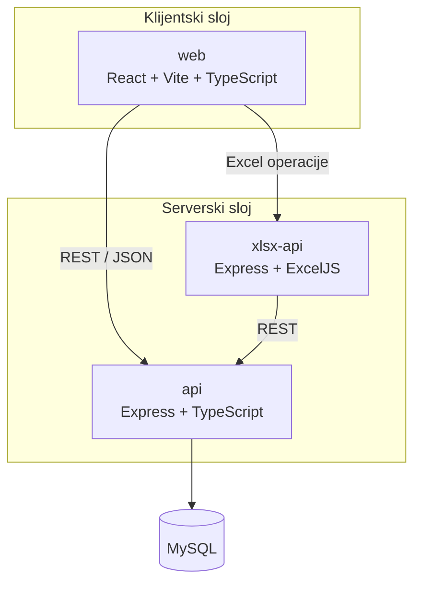

# Arhitektura sistema

Ovaj dokument daje kratak tehnički pregled rešenja koje prati master rad *„Metodologije i prakse u razvoju SaaS rešenja za evidenciju i evaluaciju uspeha studenata“*.

## Kontekst

Cilj sistema je da objedini najčešće aktivnosti vezane za evidenciju i evaluaciju rada studenata: korisnike, predmete, prisustvo, poene, projektne zadatke, termine odbrane i izvoz podataka.

Javni repozitorijum je organizovan kao monorepo radi lakšeg pregleda i demonstracije. Time se ne menjaju granice odgovornosti u kodu: glavni API je podeljen po domenima, a Excel obrada je izdvojena u poseban servis.

## Pregled komponenti



## Glavni API

Ulazna tačka je `api/api/index.ts`. Ona registruje domenske rute, dok su HTTP obrada i poslovna logika izdvojene iz jednog centralnog fajla.

Domenske celine uključuju:

| Domen | Kontroler | Odgovornost |
|---|---|---|
| Autentifikacija | `auth_controller.ts` | Prijava i izdavanje JWT tokena |
| Korisnici | `korisnik_controller.ts` | Studenti i nastavno osoblje |
| Predmeti | `predmet_controller.ts` | Upravljanje predmetima |
| Prisustvo | `evidencija_kontroler.ts` | Evidencija prisustva |
| Poeni | `poeni_controller.ts` | Predispitne obaveze i poeni |
| Projekti | `projektni_zadatak_controller.ts` | Projektni zadaci |
| Odbrane | `odbrane_projekta_controller.ts` | Termini odbrane |
| Uvoz/izvoz | `excel_controller.ts`, `student_poeni_controller.ts` | Razmena podataka |

Kontroleri delegiraju rad servisima, čime se HTTP sloj odvaja od poslovne logike. Dalje razdvajanje na modele, interfejse i repozitorijume smanjuje direktne zavisnosti i olakšava izmene pojedinačnih celina.

## Tok zahteva

Tipičan zahtev prolazi sledećim putem:

```text
React komponenta
    ↓
web/src/api/*
    ↓ HTTP
Express kontroler
    ↓
servis
    ↓
repozitorijum / data-access sloj
    ↓
MySQL
```

Za zaštićene operacije JWT middleware proverava identitet pre ulaska u poslovnu logiku.

## Klijentska aplikacija

`web/` je React aplikacija sa odvojenim stranicama za prijavu, glavni pregled i profil studenta. Komunikacija sa serverskim delom je izdvojena u `web/src/api/`, tako da komponente ne sadrže direktne detalje HTTP poziva.

Ovakva organizacija omogućava da se promena URL-a, autentifikacionog zaglavlja ili strukture poziva obavi na jednom mestu.

## Excel servis

`xlsx-api/` je izdvojen od glavnog API-ja jer obrada i generisanje Excel dokumenata predstavljaju specifičnu odgovornost sa posebnom bibliotekom i različitim profilom opterećenja.

Time glavni API ne mora da sadrži sve detalje vezane za formatiranje dokumenata.

## Baza podataka

Za domenski model korišćena je relaciona MySQL baza. Izbor odgovara podacima koji imaju jasno definisane veze: student–predmet, student–prisustvo, student–poeni, student–projekat i projekat–termin odbrane.

Konfiguracija baze se prosleđuje isključivo kroz promenljive okruženja. Pristupni podaci nisu deo repozitorijuma.

## Deployment

Paketi imaju Vercel konfiguraciju i mogu da se postavljaju kao odvojeni projekti:

- `web/` — klijentska aplikacija;
- `api/` — glavni API;
- `xlsx-api/` — servis za Excel operacije.

Ovaj javni snapshot koristi konsolidovani glavni Express API kako bi demonstracija i lokalno pokretanje bili jednostavniji. Domeni su i dalje jasno odvojeni u kodu, što omogućava kasnije fizičko izdvajanje onih delova kojima je potrebno nezavisno skaliranje.

## Veza sa principima iz rada

### Single Responsibility

Kontroleri, servisi i repozitorijumi imaju različite uloge. HTTP obrada nije isto što i poslovna logika, a poslovna logika nije isto što i pristup bazi.

### Dependency separation

Frontend zavisi od API ugovora, a ne od implementacije baze. Servisni sloj odvaja kontrolere od detalja trajnog čuvanja.

### Modularnost

Funkcionalne celine su grupisane po domenima. Izmena evidencije prisustva ne zahteva menjanje logike projektnih zadataka ili termina odbrane.

### Skaliranje po odgovornosti

Izdvojeni Excel servis je konkretan primer komponente koja može da se postavlja i skalira nezavisno od klijenta i glavnog API-ja.

## Ograničenja trenutnog javnog snapshot-a

Repozitorijum je namenjen preglednoj demonstraciji sistema i ne treba ga predstavljati kao situaciju u kojoj je svaki domenski kontroler zaseban proces. Glavni `api/` paket je jedan Express deployment sa jasno odvojenim domenima, dok je `xlsx-api/` fizički izdvojen servis.

Ovo je važna razlika između **logičke modularizacije** i **fizičkog deployment-a** i treba je jasno objasniti ako se pitanje pojavi na odbrani.
